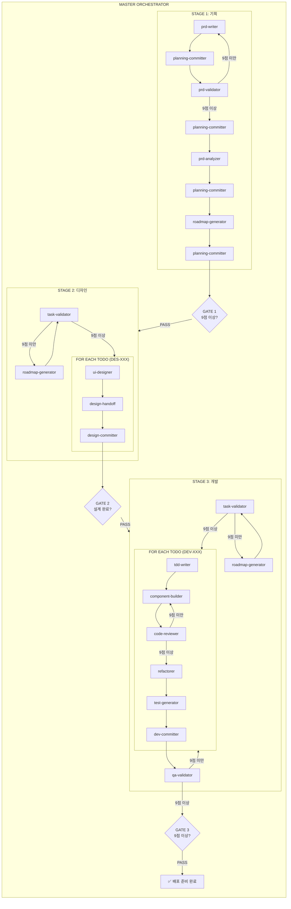
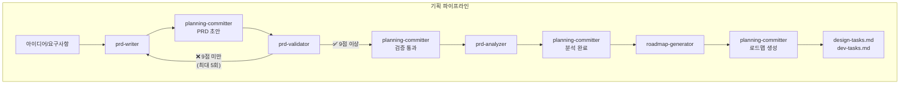
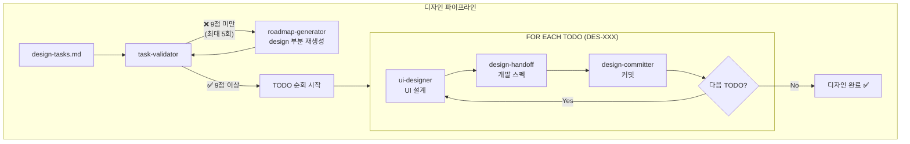
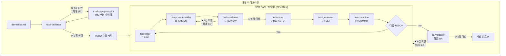

# 오케스트레이션 파이프라인 개요

전체 개발 파이프라인의 플로우와 에이전트 호출 구조를 정의합니다.

## 전체 파이프라인 (Master Orchestrator)

```
┌─────────────────────────────────────────────────────────────────────────────────────┐
│                              MASTER ORCHESTRATOR                                     │
│                                                                                      │
│  ┌────────────────────────────────────────────────────────────────────────────────┐ │
│  │                         STAGE 1: 기획 (Planning)                               │ │
│  │                                                                                 │ │
│  │  prd-writer → committer → prd-validator ─┬─→ committer → prd-analyzer          │ │
│  │       ↑                                  │                    ↓                │ │
│  │       └────────── (9점 미만) ────────────┘              committer              │ │
│  │                                                              ↓                 │ │
│  │                                          roadmap-generator → committer         │ │
│  │                                                                                 │ │
│  └──────────────────────────────┬─────────────────────────────────────────────────┘ │
│                                 │                                                    │
│                          [GATE 1: 9점 이상]                                          │
│                                 │                                                    │
│  ┌──────────────────────────────▼─────────────────────────────────────────────────┐ │
│  │                         STAGE 2: 디자인 (Design)                               │ │
│  │                                                                                 │ │
│  │  task-validator ─┬─→ FOR EACH TODO: ui-designer → design-handoff → committer   │ │
│  │        ↑         │                                                              │ │
│  │        └─────────┘ (9점 미만 → roadmap-generator)                               │ │
│  │                                                                                 │ │
│  └──────────────────────────────┬─────────────────────────────────────────────────┘ │
│                                 │                                                    │
│                          [GATE 2: 설계 완료]                                         │
│                                 │                                                    │
│  ┌──────────────────────────────▼─────────────────────────────────────────────────┐ │
│  │                         STAGE 3: 개발 (Development)                            │ │
│  │                                                                                 │ │
│  │  task-validator ─┬─→ FOR EACH TODO: tdd → builder → reviewer ─┬─→ refactorer   │ │
│  │        ↑         │                           ↑                │       ↓        │ │
│  │        └─────────┘ (9점 미만)                └── (9점 미만) ──┘   test-gen      │ │
│  │                                                                       ↓        │ │
│  │                                                                   committer    │ │
│  │                                                                       ↓        │ │
│  │                                                    qa-validator ──(9점 미만)──→ │ │
│  │                                                         │         (해당 TODO   │ │
│  │                                                         │          재작업)     │ │
│  └─────────────────────────────────────────────────────────┼──────────────────────┘ │
│                                                             │                        │
│                                                      [GATE 3: 9점 이상]              │
│                                                             │                        │
│                                                             ▼                        │
│                                                     ✅ 배포 준비 완료                 │
└─────────────────────────────────────────────────────────────────────────────────────┘
```

---

## Mermaid 플로우차트

### 전체 파이프라인



---

## 단계별 상세 플로우

### STAGE 1: 기획 (Planning Orchestrator)



**커밋 포인트:**
| 시점 | 커밋 타입 | 메시지 예시 |
|------|-----------|-------------|
| PRD 초안 작성 | `docs` | `docs : PRD 초안 작성` |
| PRD 검증 통과 | `docs` | `docs : PRD 검증 통과 (9/10점)` |
| PRD 분석 완료 | `docs` | `docs : PRD 개발 분석 완료` |
| 로드맵 생성 | `docs` | `docs : 디자인/개발 TODO 생성` |

---

### STAGE 2: 디자인 (Design Orchestrator)



**TODO별 커밋:**

```
docs : [DES-001] 디자인 토큰 정의
docs : [DES-002] 메인 레이아웃 와이어프레임
docs : [DES-003] 에디터 컴포넌트 설계
...
```

---

### STAGE 3: 개발 (Dev Orchestrator)



**TDD 사이클:**

```
🔴 RED (tdd-writer)
    ↓
🟢 GREEN (component-builder)
    ↓
📝 REVIEW (code-reviewer) ──→ 9점 미만 ──→ 🟢 재작업
    ↓ 9점 이상
♻️ REFACTOR (refactorer)
    ↓
🧪 TEST (test-generator)
    ↓
📦 COMMIT (dev-committer)
```

---

## 품질 게이트 (Quality Gates)

```
┌──────────────────────────────────────────────────────────────────────────┐
│                          QUALITY GATES SUMMARY                           │
├──────────────────────────────────────────────────────────────────────────┤
│                                                                          │
│  GATE 1: 기획 검증                                                       │
│  ├─ 검증자: prd-validator                                                │
│  ├─ 통과 기준: 9/10 이상                                                 │
│  ├─ 최대 재시도: 5회                                                     │
│  └─ 실패 시: prd-writer 재작업                                           │
│                                                                          │
│  GATE 2: 디자인 TODO 검증                                                │
│  ├─ 검증자: task-validator                                               │
│  ├─ 통과 기준: 9/10 이상                                                 │
│  ├─ 최대 재시도: 5회                                                     │
│  └─ 실패 시: roadmap-generator 재호출 (design 부분)                      │
│                                                                          │
│  GATE 3: 코드 리뷰 (TODO별)                                              │
│  ├─ 검증자: code-reviewer                                                │
│  ├─ 통과 기준: 9/10 이상                                                 │
│  ├─ 최대 재시도: 5회/TODO                                                │
│  └─ 실패 시: component-builder 재작업                                    │
│                                                                          │
│  GATE 4: 개발 TODO 검증                                                  │
│  ├─ 검증자: task-validator                                               │
│  ├─ 통과 기준: 9/10 이상                                                 │
│  ├─ 최대 재시도: 5회                                                     │
│  └─ 실패 시: roadmap-generator 재호출 (dev 부분)                         │
│                                                                          │
│  GATE 5: 최종 QA                                                         │
│  ├─ 검증자: qa-validator                                                 │
│  ├─ 통과 기준: 9/10 이상                                                 │
│  ├─ 최대 재시도: 2회                                                     │
│  └─ 실패 시: 이슈 TODO 재작업                                            │
│                                                                          │
└──────────────────────────────────────────────────────────────────────────┘
```

---

## 에이전트 목록

### 오케스트레이터 (Orchestrators)

| 번호 | 이름                  | 설명                       | 도구                                      |
| ---- | --------------------- | -------------------------- | ----------------------------------------- |
| 00   | master-orchestrator   | 전체 파이프라인 총괄       | Read, Write, Edit, Glob, Grep, Bash, Task |
| 10   | planning-orchestrator | 기획 단계 오케스트레이터   | Read, Write, Edit, Glob, Grep, Bash, Task |
| 20   | design-orchestrator   | 디자인 단계 오케스트레이터 | Read, Write, Edit, Glob, Grep, Bash, Task |
| 30   | dev-orchestrator      | 개발 단계 오케스트레이터   | Read, Write, Edit, Glob, Grep, Bash, Task |

### 기획 에이전트 (11-19)

| 번호 | 이름               | 역할                  |
| ---- | ------------------ | --------------------- |
| 11   | prd-writer         | PRD 작성              |
| 12   | prd-validator      | PRD 검증 및 점수 부여 |
| 13   | prd-analyzer       | PRD 개발 분석         |
| 14   | roadmap-generator  | 디자인/개발 TODO 생성 |
| 15   | planning-committer | 기획 단계 커밋        |

### 디자인 에이전트 (21-29)

| 번호 | 이름             | 역할             |
| ---- | ---------------- | ---------------- |
| 21   | ui-designer      | UI/UX 설계       |
| 22   | design-handoff   | 개발자 스펙 변환 |
| 23   | design-committer | 디자인 단계 커밋 |

### 개발 에이전트 (31-39)

| 번호 | 이름              | 역할                   |
| ---- | ----------------- | ---------------------- |
| 31   | tdd-writer        | TDD 테스트 작성        |
| 32   | component-builder | 컴포넌트 구현          |
| 33   | code-reviewer     | 코드 리뷰 및 점수 부여 |
| 34   | refactorer        | 리팩토링               |
| 35   | test-generator    | 추가 테스트 생성       |
| 36   | qa-validator      | 최종 QA 검증           |
| 37   | dev-committer     | 개발 단계 커밋         |

### 유틸리티 에이전트 (91-99)

| 번호 | 이름            | 역할               |
| ---- | --------------- | ------------------ |
| 91   | task-validator  | TODO 리스트 검증   |
| 99   | agent-validator | 에이전트 파일 검증 |

---

## 커밋 흐름

```
┌─────────────────────────────────────────────────────────────────────────┐
│                           COMMIT FLOW                                   │
├─────────────────────────────────────────────────────────────────────────┤
│                                                                         │
│  기획 단계 (planning-committer)                                           │
│  ├─ docs : PRD 초안 작성                                                  │
│  ├─ docs : PRD 검증 통과 (9/10점)                                         │
│  ├─ docs : PRD 개발 분석 완료                                             │
│  └─ docs : 디자인/개발 TODO 생성                                           │
│                                                                         │
│  디자인 단계 (design-committer) - TODO별                                  │
│  ├─ docs : [DES-001] 디자인 토큰 정의                                     │
│  ├─ docs : [DES-002] 메인 레이아웃 와이어프레임                            │
│  ├─ docs : [DES-003] 에디터 컴포넌트 설계                               │
│  └─ ...                                                                 │
│                                                                         │
│  개발 단계 (dev-committer) - TODO별                                     │
│  ├─ feat : [DEV-001] 프로젝트 초기화                                    │
│  ├─ feat : [DEV-002] 에디터 컴포넌트 구현                               │
│  ├─ feat : [DEV-003] 프리뷰 컴포넌트 구현                               │
│  ├─ fix : [DEV-010] 마크다운 파싱 버그 수정                             │
│  ├─ refactor : [DEV-015] 상태 관리 리팩토링                             │
│  └─ ...                                                                 │
│                                                                         │
└─────────────────────────────────────────────────────────────────────────┘
```

---

## 파일 구조

```
.claude/
├── agents/
│   ├── 00--master-orchestrator.md
│   │
│   ├── 10--planning-orchestrator.md
│   ├── 11--planning--prd-writer.md
│   ├── 12--planning--prd-validator.md
│   ├── 13--planning--prd-analyzer.md
│   ├── 14--planning--roadmap-generator.md
│   ├── 15--planning--committer.md
│   │
│   ├── 20--design-orchestrator.md
│   ├── 21--design--ui-designer.md
│   ├── 22--design--design-handoff.md
│   ├── 23--design--committer.md
│   │
│   ├── 30--dev-orchestrator.md
│   ├── 31--dev--tdd-writer.md
│   ├── 32--dev--component-builder.md
│   ├── 33--dev--code-reviewer.md
│   ├── 34--dev--refactorer.md
│   ├── 35--dev--test-generator.md
│   ├── 36--dev--qa-validator.md
│   ├── 37--dev--committer.md
│   │
│   ├── 91--util--task-validator.md
│   └── 99--etc--agent-validator.md
│
├── tasks/
│   ├── design-tasks.md
│   └── dev-tasks.md
│
├── commit-guide.md
├── prd-analysis.md
└── pipeline-overview.md  ← 현재 문서
```

---

## 실행 예시

### 전체 파이프라인 실행

```
사용자: "전체 파이프라인 실행"
→ master-orchestrator 호출
→ 기획 → 디자인 → 개발 순차 실행
```

### 단계별 실행

```
사용자: "기획 파이프라인 실행"
→ planning-orchestrator 호출

사용자: "디자인 파이프라인 실행"
→ design-orchestrator 호출

사용자: "개발 파이프라인 실행"
→ dev-orchestrator 호출
```

---

## 재시도 정책 요약

| 게이트           | 검증자         | 최대 재시도 | 실패 시 액션             |
| ---------------- | -------------- | ----------- | ------------------------ |
| 기획 검증        | prd-validator  | 5회         | prd-writer 재작업        |
| 디자인 TODO 검증 | task-validator | 5회         | roadmap-generator 재호출 |
| 코드 리뷰        | code-reviewer  | 5회/TODO    | component-builder 재작업 |
| 개발 TODO 검증   | task-validator | 5회         | roadmap-generator 재호출 |
| 최종 QA          | qa-validator   | 2회         | 이슈 TODO 재작업         |

**5회 실패 시**: 사용자 수동 개입 요청

---

_문서 버전: 1.0_
_최종 수정: 2026-01-15_
